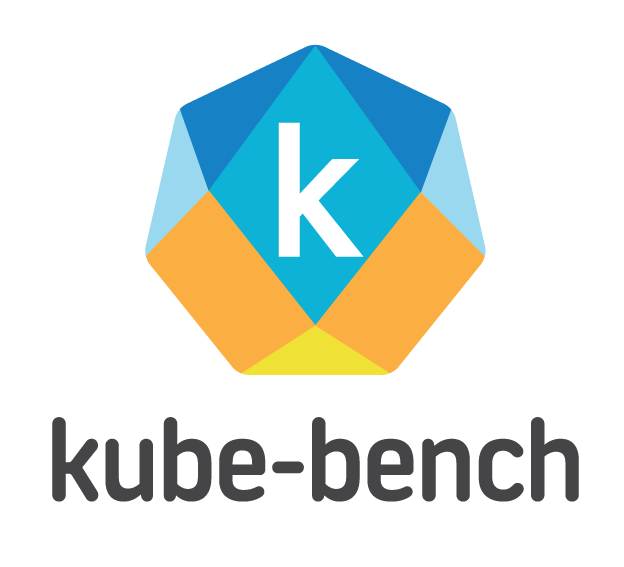

[](https://travis-ci.org/aquasecurity/kube-bench)
[](https://github.com/aquasecurity/kube-bench/blob/master/LICENSE)
[](https://microbadger.com/images/aquasec/kube-bench "Get your own image badge on microbadger.com")
[](https://microbadger.com/images/aquasec/kube-bench)
[![Coverage Status][cov-img]][cov]

[cov-img]: https://codecov.io/github/aquasecurity/kube-bench/branch/master/graph/badge.svg
[cov]: https://codecov.io/github/aquasecurity/kube-bench


kube-bench is a Go application that checks whether Kubernetes is deployed securely by running the checks documented in the [CIS Kubernetes Benchmark](https://www.cisecurity.org/benchmark/kubernetes/).

Tests are configured with YAML files, making this tool easy to update as test specifications evolve.

### Please Note

1. kube-bench implements the [CIS Kubernetes Benchmark](https://www.cisecurity.org/benchmark/kubernetes/) as closely as possible. Please raise issues here if kube-bench is not correctly implementing the test as described in the Benchmark. To report issues in the Benchmark itself (for example, tests that you believe are inappropriate), please join the [CIS community](https://cisecurity.org).

1. There is not a one-to-one mapping between releases of Kubernetes and releases of the CIS benchmark. See [CIS Kubernetes Benchmark support](#cis-kubernetes-benchmark-support) to see which releases of Kubernetes are covered by different releases of the benchmark.

1. It is impossible to inspect the master nodes of managed clusters, e.g. GKE, EKS and AKS, using kube-bench as one does not have access to such nodes, although it is still possible to use kube-bench to check worker node configuration in these environments.


Table of Contents
=================

  - [CIS Kubernetes Benchmark support](#cis-kubernetes-benchmark-support)
  - [Installation](#installation)
  - [Running kube-bench](#running-kube-bench)
    - [Running inside a container](#running-inside-a-container)
    - [Running in a Kubernetes cluster](#running-in-a-kubernetes-cluster)
    - [Running in an AKS cluster](#running-in-an-aks-cluster)
    - [Running in an EKS cluster](#running-in-an-eks-cluster)
    - [Running on OpenShift](#running-on-openshift)
    - [Running in an GKE cluster](#running-in-a-gke-cluster)
    - [Installing from a container](#installing-from-a-container)
    - [Download and Install binaries](#download-and-install-binaries)
    - [Installing from sources](#installing-from-sources)
  - [Output](#output)
  - [Configuration](#configuration)
  - [Troubleshooting](#troubleshooting)
  - [Test config YAML representation](#test-config-yaml-representation)
    - [Omitting checks](#omitting-checks)
  - [Roadmap](#roadmap)
  - [Testing locally with kind](#testing-locally-with-kind)
  - [Contributing](#contributing)
    - [Bugs](#bugs)
    - [Features](#features)
    - [Pull Requests](#pull-requests)


## CIS Kubernetes Benchmark support

kube-bench supports the tests for Kubernetes as defined in the [CIS Kubernetes Benchmarks](https://www.cisecurity.org/benchmark/kubernetes/).

| CIS Kubernetes Benchmark | kube-bench config | Kubernetes versions |
|---|---|---|
| [1.5.1](https://workbench.cisecurity.org/benchmarks/4892) | cis-1.5 | 1.15- |
| [1.6.0](https://workbench.cisecurity.org/benchmarks/4834) | cis-1.6 | 1.16- |
| [GKE 1.0.0](https://workbench.cisecurity.org/benchmarks/4536) | gke-1.0 | GKE |
| [EKS 1.0.0](https://workbench.cisecurity.org/benchmarks/5190) | eks-1.0 | EKS |
| Red Hat OpenShift hardening guide | rh-0.7 | OCP 3.10-3.11 |

By default, kube-bench will determine the test set to run based on the Kubernetes version running on the machine, but please note that kube-bench does not automatically detect OpenShift and GKE - see the section below on [Running kube-bench](https://github.com/aquasecurity/kube-bench#running-kube-bench).

## Installation

You can choose to
* Run kube-bench from inside a container (sharing PID namespace with the host). See [Running inside a container](#running-inside-a-container) for additional details.
* Run a container that installs kube-bench on the host, and then run kube-bench directly on the host. See [Installing from a container](#installing-from-a-container) for additional details.
* install the latest binaries from the [Releases page](https://github.com/aquasecurity/kube-bench/releases), though please note that you also need to download the config and test files from the `cfg` directory. See [Download and Install binaries](#download-and-install-binaries) for details.
* Compile it from source. See [Installing from sources](#installing-from-sources) for details.

## Running kube-bench

If you run kube-bench directly from the command line you may need to be root / sudo to have access to all the config files.

kube-bench automatically selects which `controls` to use based on the detected
node type and the version of Kubernetes a cluster is running. This behavior
can be overridden by specifying the `master` or `node` subcommand and the
`--version` flag on the command line.


The Kubernetes version can also be set with the `KUBE_BENCH_VERSION` environment variable.
The value of `--version` takes precedence over the value of `KUBE_BENCH_VERSION`.

For example, run kube-bench against a master with version auto-detection:

```
kube-bench master
```

Or run kube-bench against a worker node using the tests for Kubernetes version 1.13:

```
kube-bench node --version 1.13
```

`kube-bench` will map the `--version` to the corresponding CIS Benchmark version as indicated by the mapping table above. For example, if you specify `--version 1.15`, this is mapped to CIS Benchmark version `cis-1.15`.

Alternatively, you can specify `--benchmark` to run a specific CIS Benchmark version:

```
kube-bench node --benchmark cis-1.5
```

If you want to target specific CIS Benchmark `target` (i.e master, node, etcd, etc...)
you can use the `run --targets` subcommand.
```
kube-bench --benchmark cis-1.5 run --targets master,node
```
or
```
kube-bench --benchmark cis-1.5 run --targets master,node,etcd,policies
```

The following table shows the valid targets based on the CIS Benchmark version.
| CIS Benchmark | Targets |
|---|---|
| cis-1.5| master, controlplane, node, etcd, policies |
| cis-1.6| master, controlplane, node, etcd, policies |
| gke-1.0| master, controlplane, node, etcd, policies, managedservices |
| eks-1.0| controlplane, node, policies, managedservices |

If no targets are specified, `kube-bench` will determine the appropriate targets based on the CIS Benchmark version.

`controls` for the various versions of CIS Benchmark can be found in directories
with same name as the CIS Benchmark versions under `cfg/`, for example `cfg/cis-1.5`.

**Note:**  **`It is an error to specify both --version and --benchmark flags together`**

### Running inside a container

You can avoid installing kube-bench on the host by running it inside a container using the host PID namespace and mounting the `/etc` and `/var` directories where the configuration and other files are located on the host so that kube-bench can check their existence and permissions.

```
docker run --pid=host -v /etc:/etc:ro -v /var:/var:ro -t aquasec/kube-bench:latest [master|node] --version 1.13
```

> Note: the tests require either the kubelet or kubectl binary in the path in order to auto-detect the Kubernetes version. You can pass `-v $(which kubectl):/usr/local/mount-from-host/bin/kubectl` to resolve this. You will also need to pass in kubeconfig credentials. For example:

```
docker run --pid=host -v /etc:/etc:ro -v /var:/var:ro -v $(which kubectl):/usr/local/mount-from-host/bin/kubectl -v ~/.kube:/.kube -e KUBECONFIG=/.kube/config -t aquasec/kube-bench:latest [master|node]
```

You can use your own configs by mounting them over the default ones in `/opt/kube-bench/cfg/`

```
docker run --pid=host -v /etc:/etc:ro -v /var:/var:ro -t -v path/to/my-config.yaml:/opt/kube-bench/cfg/config.yam -v $(which kubectl):/usr/local/mount-from-host/bin/kubectl -v ~/.kube:/.kube -e KUBECONFIG=/.kube/config aquasec/kube-bench:latest [master|node]
```

### Running in a Kubernetes cluster

You can run kube-bench inside a pod, but it will need access to the host's PID namespace in order to check the running processes, as well as access to some directories on the host where config files and other files are stored.

Master nodes are automatically detected by kube-bench and will run master checks when possible.
The detection is done by verifying that mandatory components for master, as defined in the config files, are running (see [Configuration](#configuration)).

The supplied `job.yaml` file can be applied to run the tests as a job. For example:

```bash
$ kubectl apply -f job.yaml
job.batch/kube-bench created

$ kubectl get pods
NAME                      READY   STATUS              RESTARTS   AGE
kube-bench-j76s9   0/1     ContainerCreating   0          3s

# Wait for a few seconds for the job to complete
$ kubectl get pods
NAME                      READY   STATUS      RESTARTS   AGE
kube-bench-j76s9   0/1     Completed   0          11s

# The results are held in the pod's logs
kubectl logs kube-bench-j76s9
[INFO] 1 Master Node Security Configuration
[INFO] 1.1 API Server
...
```

You can still force to run specific master or node checks using respectively `job-master.yaml` and `job-node.yaml`.

To run the tests on the master node, the pod needs to be scheduled on that node. This involves setting a nodeSelector and tolerations in the pod spec.

The default labels applied to master nodes has changed since Kubernetes 1.11, so if you are using an older version you may need to modify the nodeSelector and tolerations to run the job on the master node.


### Running in an AKS cluster

1. Create an AKS cluster(e.g. 1.13.7) with RBAC enabled, otherwise there would be 4 failures

1. Use the [kubectl-enter plugin] (https://github.com/kvaps/kubectl-enter) to shell into a node
`
kubectl-enter {node-name}
`
or ssh to one agent node
could open nsg 22 port and assign a public ip for one agent node (only for testing purpose)

1. Run CIS benchmark to view results:
```
docker run --rm -v `pwd`:/host aquasec/kube-bench:latest install
./kube-bench node
```
kube-bench cannot be run on AKS master nodes

### Running in an EKS cluster

There is a `job-eks.yaml` file for running the kube-bench node checks on an EKS cluster. The significant difference on EKS is that it's not possible to schedule jobs onto the master node, so master checks can't be performed

1. To create an EKS Cluster refer to [Getting Started with Amazon EKS](https://docs.aws.amazon.com/eks/latest/userguide/getting-started.html) in the *Amazon EKS User Guide*
  - Information on configuring `eksctl`, `kubectl` and the AWS CLI is within
2. Create an [Amazon Elastic Container Registry (ECR)](https://docs.aws.amazon.com/AmazonECR/latest/userguide/what-is-ecr.html) repository to host the kube-bench container image
```
aws ecr create-repository --repository-name k8s/kube-bench --image-tag-mutability MUTABLE
```
3. Download, build and push the kube-bench container image to your ECR repo
```
git clone https://github.com/aquasecurity/kube-bench.git
cd kube-bench
aws ecr get-login-password --region <AWS_REGION> | docker login --username <AWS_USERNAME> --password-stdin <AWS_ACCT_NUMBER>.dkr.ecr.<AWS_REGION>.amazonaws.com
docker build -t k8s/kube-bench .
docker tag k8s/kube-bench:latest <AWS_ACCT_NUMBER>.dkr.ecr.<AWS_REGION>.amazonaws.com/k8s/kube-bench:latest
docker push <AWS_ACCT_NUMBER>.dkr.ecr.<AWS_REGION>.amazonaws.com/k8s/kube-bench:latest
```
4. Copy the URI of your pushed image, the URI format is like this: `<AWS_ACCT_NUMBER>.dkr.ecr.<AWS_REGION>.amazonaws.com/k8s/kube-bench:latest`
5. Replace the `image` value in `job-eks.yaml` with the URI from Step 4
6. Run the kube-bench job on a Pod in your Cluster: `kubectl apply -f job-eks.yaml`
7. Find the Pod that was created, it *should* be in the `default` namespace: `kubectl get pods --all-namespaces`
8. Retrieve the value of this Pod and output the report, note the Pod name will vary: `kubectl logs kube-bench-<value>`
  - You can save the report for later reference: `kubectl logs kube-bench-<value> > kube-bench-report.txt`

#### Report kube-bench findings to AWS Security Hub

You can configure kube-bench with the `--asff` option to send findings to AWS Security Hub for any benchmark tests that fail or that generate a warning. See [this page][kube-bench-aws-security-hub] for more information on how to enable the kube-bench integration with AWS Security Hub.

### Running on OpenShift

| OpenShift Hardening Guide | kube-bench config |
|---|---|
| ocp-3.10| rh-0.7 |
| ocp-3.11| rh-0.7 |
| ocp-4.* | Not supported |

kube-bench includes a set of test files for Red Hat's OpenShift hardening guide for OCP 3.10 and 3.11. To run this you will need to specify `--benchmark rh-07`, or `--version ocp-3.10` or `--version ocp-3.11`

when you run the `kube-bench` command (either directly or through YAML).

There is work in progress on a [CIS Red Hat OpenShift Container Platform Benchmark](https://workbench.cisecurity.org/benchmarks/5248) which we believe should cover OCP 4.* and we intend to add support in kube-bench when it's published.

### Running in a GKE cluster

| CIS Benchmark | Targets |
|---|---|
| gke-1.0| master, controlplane, node, etcd, policies, managedservices |

kube-bench includes benchmarks for GKE. To run this you will need to specify `--benchmark gke-1.0` when you run the `kube-bench` command.

To run the benchmark as a job in your GKE cluster apply the included `job-gke.yaml`.

```
kubectl apply -f job-gke.yaml
```

### Installing from a container

This command copies the kube-bench binary and configuration files to your host from the Docker container:
**binaries compiled for linux-x86-64 only (so they won't run on macOS or Windows)**
```
docker run --rm -v `pwd`:/host aquasec/kube-bench:latest install
```

You can then run `./kube-bench [master|node]`.

### Download and Install binaries

It is possible to manually install and run kube-bench release binaries. In order to do that, you must have access to your Kubernetes cluster nodes. Note that if you're using one of the managed Kubernetes services (e.g. EKS, AKS, GKE), you will not have access to the master nodes of your cluster and you can’t perform any tests on the master nodes.

First, log into one of the nodes using SSH.

Install kube-bench binary for your platform using the commands below. Note that there may be newer releases available. See [releases page](https://github.com/aquasecurity/kube-bench/releases).

Ubuntu/Debian:

```
curl -L https://github.com/aquasecurity/kube-bench/releases/download/v0.3.1/kube-bench_0.3.1_linux_amd64.deb -o kube-bench_0.3.1_linux_amd64.deb

sudo apt install ./kube-bench_0.3.1_linux_amd64.deb -f
```

RHEL:

```
curl -L https://github.com/aquasecurity/kube-bench/releases/download/v0.3.1/kube-bench_0.3.1_linux_amd64.rpm -o kube-bench_0.3.1_linux_amd64.rpm

sudo yum install kube-bench_0.3.1_linux_amd64.rpm -y
```

Alternatively, you can manually download and extract the kube-bench binary:

```
curl -L https://github.com/aquasecurity/kube-bench/releases/download/v0.3.1/kube-bench_0.3.1_linux_amd64.tar.gz -o kube-bench_0.3.1_linux_amd64.tar.gz

tar -xvf kube-bench_0.3.1_linux_amd64.tar.gz
```

You can then run kube-bench directly:
```
kube-bench [master|node]
```

If you manually downloaded the kube-bench binary (using curl command above), you have to specify the location of configuration directory and file. For example:
```
./kube-bench --config-dir `pwd`/cfg --config `pwd`/cfg/config.yaml [master|node]
```

See previous section on [Running kube-bench](#running-kube-bench) for further details on using the kube-bench binary.

### Installing from sources

If Go is installed on the target machines, you can simply clone this repository and run as follows (assuming your [`GOPATH` is set](https://github.com/golang/go/wiki/GOPATH)):

```shell
go get github.com/aquasecurity/kube-bench
cd $GOPATH/src/github.com/aquasecurity/kube-bench
go build -o kube-bench .

# See all supported options
./kube-bench --help

# Run all checks
./kube-bench
```

## Output

There are four output states:
- [PASS] indicates that the test was run successfully, and passed.
- [FAIL] indicates that the test was run successfully, and failed. The remediation output describes how to correct the configuration, or includes an error message describing why the test could not be run.
- [WARN] means this test needs further attention, for example it is a test that needs to be run manually. Check the remediation output for further information.
- [INFO] is informational output that needs no further action.

Note:
- If the test is Manual, this always generates WARN (because the user has to run it manually)
- If the test is Scored, and kube-bench was unable to run the test, this generates FAIL (because the test has not been passed, and as a Scored test, if it doesn't pass then it must be considered a failure).
- If the test is Not Scored, and kube-bench was unable to run the test, this generates WARN.
- If the test is Scored, type is empty, and there are no `test_items` present, it generates a WARN. This is to highlight tests that appear to be incompletely defined.

## Configuration

Kubernetes configuration and binary file locations and names can vary from installation to installation, so these are configurable in the `cfg/config.yaml` file.

Any settings in the version-specific config file `cfg/<version>/config.yaml` take precedence over settings in the main `cfg/config.yaml` file.

You can read more about `kube-bench` configuration in our [documentation](docs/README.md#configuration-and-variables).

## Troubleshooting

Running `kube-bench` with the `-v 3` parameter will generate debug logs that can be very helpful for debugging problems.

If you are using one of the example `job*.yaml` files, you will need to edit the `command` field, for example `["kube-bench", "-v", "3"]`. Once the job has run, the logs can be retrieved using `kubectl logs` on the job's pod.

## Test config YAML representation

The tests (or "controls") are represented as YAML documents (installed by default into `./cfg`). There are different versions of these test YAML files reflecting different versions of the CIS Kubernetes Benchmark. You will find more information about the test file YAML definitions in our [documentation](docs/README.md).

### Omitting checks

If you decide that a recommendation is not appropriate for your environment, you can choose to omit it by editing the test YAML file to give it the check type `skip` as in this example:

```yaml
  checks:
  - id: 2.1.1
    text: "Ensure that the --allow-privileged argument is set to false (Scored)"
    type: "skip"
    scored: true
```

No tests will be run for this check and the output will be marked [INFO].

## Roadmap

Going forward we plan to release updates to kube-bench to add support for new releases of the CIS Benchmark. Note that these are not released as frequently as Kubernetes releases.

We welcome PRs and issue reports.

## Testing locally with kind

Our makefile contains targets to test your current version of kube-bench inside a [Kind](https://kind.sigs.k8s.io/) cluster. This can be very handy if you don't want to run a real Kubernetes cluster for development purposes.

First, you'll need to create the cluster using `make kind-test-cluster` this will create a new cluster if it cannot be found on your machine. By default, the cluster is named `kube-bench` but you can change the name by using the environment variable `KIND_PROFILE`.

*If kind cannot be found on your system the target will try to install it using `go get`*

Next, you'll have to build the kube-bench docker image using `make build-docker`, then we will be able to push the docker image to the cluster using `make kind-push`.

Finally, we can use the `make kind-run` target to run the current version of kube-bench in the cluster and follow the logs of pods created. (Ctrl+C to exit)

Every time you want to test a change, you'll need to rebuild the docker image and push it to cluster before running it again. ( `make build-docker kind-push kind-run` )

## Contributing
Kindly read [Contributing.md](CONTRIBUTING.md) before contributing. Some instructions for the common contributions are stated below.

### Bugs

If you think you have found a bug please follow the instructions below.

- Please spend a small amount of time giving due diligence to the issue tracker. Your issue might be a duplicate.
- Open a [new issue](https://github.com/aquasecurity/kube-bench/issues/new) if a duplicate doesn't already exist.
- Note the version of kube-bench you are running (from `kube-bench version`) and the command line options you are using.
- Note the version of Kubernetes you are running (from `kubectl version` or `oc version` for OpenShift).
- Set `-v 10` command line option and save the log output. Please paste this into your issue.
- Remember users might be searching for your issue in the future, so please give it a meaningful title to help others.

### Features

We also use the GitHub issue tracker to track feature requests. If you have an idea to make kube-bench even more awesome follow the steps below.

- Open a [new issue](https://github.com/aquasecurity/kube-bench/issues/new).
- Remember users might be searching for your issue in the future, so please give it a meaningful title to helps others.
- Clearly define the use case, using concrete examples. For example, I type `this` and kube-bench does `that`.
- If you would like to include a technical design for your feature please feel free to do so.

### Pull Requests

We welcome pull requests!

- Your PR is more likely to be accepted if it focuses on just one change.
- Please include a comment with the results before and after your change.
- Your PR is more likely to be accepted if it includes tests. (We have not historically been very strict about tests, but we would like to improve this!).
- You're welcome to submit a draft PR if you would like early feedback on an idea or an approach.
- Happy coding!

[kube-bench-aws-security-hub]: ./docs/asff.md