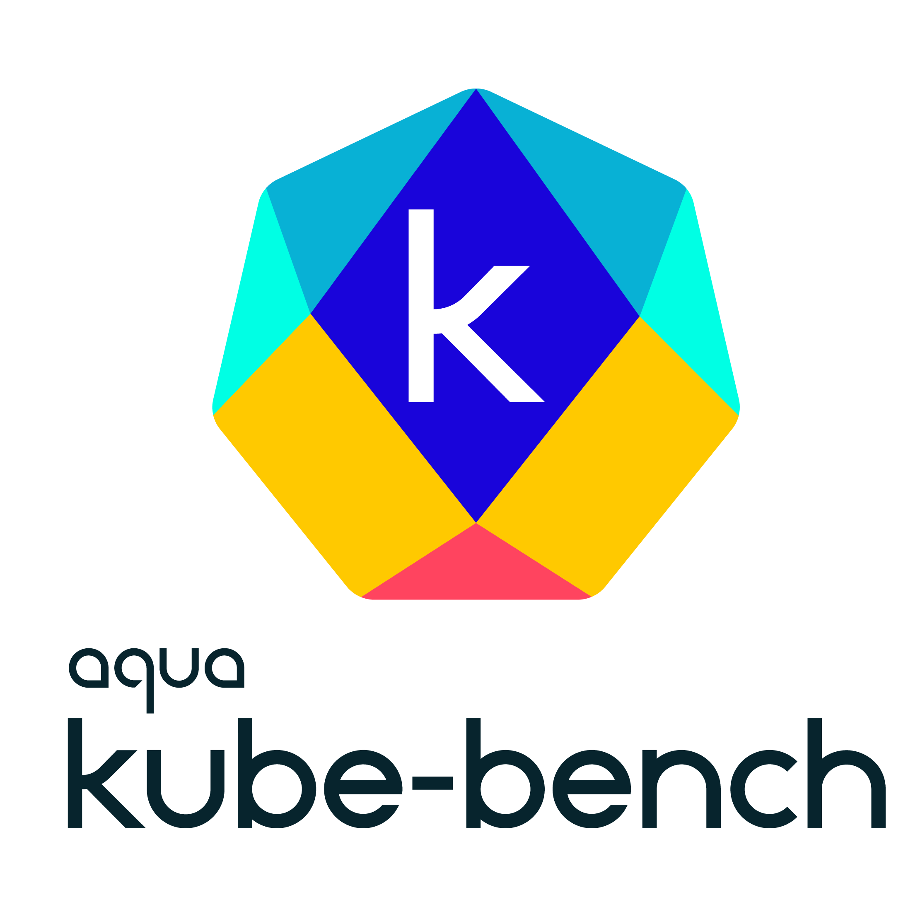

[![GitHub Release][release-img]][release]
[![Downloads][download]][release]
[![Docker Pulls][docker-pull]][docker]
[![Go Report Card][report-card-img]][report-card]
[](https://github.com/aquasecurity/kube-bench/actions)
[](https://github.com/aquasecurity/kube-bench/blob/main/LICENSE)
[![Coverage Status][cov-img]][cov]

[download]: https://img.shields.io/github/downloads/aquasecurity/kube-bench/total?logo=github
[release-img]: https://img.shields.io/github/release/aquasecurity/kube-bench.svg?logo=github
[release]: https://github.com/aquasecurity/kube-bench/releases
[docker-pull]: https://img.shields.io/docker/pulls/aquasec/kube-bench?logo=docker&label=docker%20pulls%20%2F%20kube-bench
[docker]: https://hub.docker.com/r/aquasec/kube-bench
[cov-img]: https://codecov.io/github/aquasecurity/kube-bench/branch/main/graph/badge.svg
[cov]: https://codecov.io/github/aquasecurity/kube-bench
[report-card-img]: https://goreportcard.com/badge/github.com/aquasecurity/kube-bench
[report-card]: https://goreportcard.com/report/github.com/aquasecurity/kube-bench



kube-bench is a tool that checks whether Kubernetes is deployed securely by running the checks documented in the [CIS Kubernetes Benchmark](https://www.cisecurity.org/benchmark/kubernetes/).

Tests are configured with YAML files, making this tool easy to update as test specifications evolve.


### Quick start

There are multiple ways to run kube-bench.
You can run kube-bench inside a pod, but it will need access to the host's PID namespace in order to check the running processes, as well as access to some directories on the host where config files and other files are stored.

The supplied `job.yaml` [file](job.yaml) can be applied to run the tests as a job. For example:

```bash
$ kubectl apply -f job.yaml
job.batch/kube-bench created

$ kubectl get pods
NAME                      READY   STATUS              RESTARTS   AGE
kube-bench-j76s9   0/1     ContainerCreating   0          3s

# Wait for a few seconds for the job to complete
$ kubectl get pods
NAME                      READY   STATUS      RESTARTS   AGE
kube-bench-j76s9   0/1     Completed   0          11s

# The results are held in the pod's logs
kubectl logs kube-bench-j76s9
[INFO] 1 Master Node Security Configuration
[INFO] 1.1 API Server
...
```
For more information and different ways to run kube-bench see [documentation](docs/running.md)
### Please Note

1. kube-bench implements the [CIS Kubernetes Benchmark](https://www.cisecurity.org/benchmark/kubernetes/) as closely as possible. Please raise issues here if kube-bench is not correctly implementing the test as described in the Benchmark. To report issues in the Benchmark itself (for example, tests that you believe are inappropriate), please join the [CIS community](https://cisecurity.org).

1. There is not a one-to-one mapping between releases of Kubernetes and releases of the CIS benchmark. See [CIS Kubernetes Benchmark support](docs/platforms.md#cis-kubernetes-benchmark-support) to see which releases of Kubernetes are covered by different releases of the benchmark.


By default, kube-bench will determine the test set to run based on the Kubernetes version running on the machine.
- see the following documentation on [Running kube-bench](docs/running.md#running-kube-bench) for more details.


## Contributing
Kindly read [Contributing](CONTRIBUTING.md) before contributing. 
We welcome PRs and issue reports.

## Roadmap

Going forward we plan to release updates to kube-bench to add support for new releases of the CIS Benchmark. Note that these are not released as frequently as Kubernetes releases.
