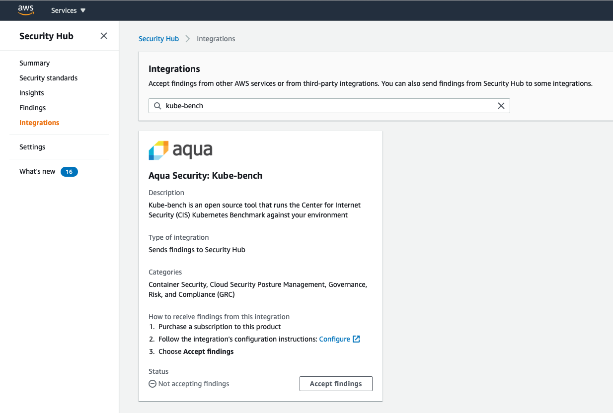
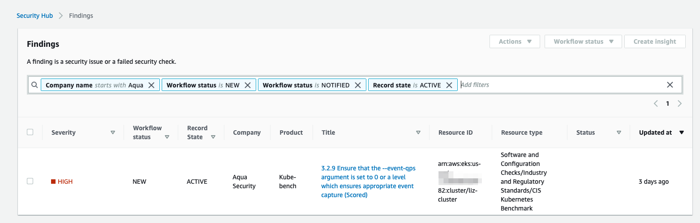

# Integrating kube-bench with AWS Security Hub

You can configure kube-bench with the `--asff` to send findings to AWS Security Hub. There are some additional steps required so that kube-bench has information and permissions to send these findings.

## Enable the AWS Security Hub integration

* You will need AWS Security Hub to be enabled in your account
* In the Security Hub console, under Integrations, search for kube-bench

<p align="center">
  
</p>

* Click on `Accept findings`. This gives information about the IAM permissions required to send findings to your Security Hub account. kube-bench runs within a pod on your EKS cluster, and will need to be associated with a Role that has these permissions.

## Configure permissions in an IAM Role

* Grant these permissions to the IAM Role that the kube-bench pod will be associated with. There are two potions:
  * You can run the kube-bench pod under a specific [service account associated with an IAM role](https://docs.aws.amazon.com/eks/latest/userguide/iam-roles-for-service-accounts.html) that has these permissions to write Security Hub findings.
  * Alternatively the pod can be granted permissions specified by the Role that your [EKS node group uses](https://docs.aws.amazon.com/eks/latest/userguide/managed-node-groups.html).
  
Here is an example IAM Policy that you can attach to your EKS node group's IAM Role: 

```json
{
    "Version": "2012-10-17",
    "Statement": [
        {
            "Effect": "Allow",
            "Action": "securityhub:BatchImportFindings",
            "Resource": [
                "arn:aws:securityhub:us-east-1::product/aqua-security/kube-bench"
            ]
        }
    ]
}
```

## Configure and rebuild kube-bench

You will need to download, build and push the kube-bench container image to your ECR repo as described in Step 3 of the [EKS instructions][eks-instructions], except that before you build the container image, you need to edit `cfg/eks-1.0/config.yaml` to specify the AWS account, AWS region, and the EKS Cluster ARN.

## Modify the job configuration

* Modify `job-eks.yaml` to specify the `--asff` flag, so that kube-bench writes output in ASFF format to Security Hub
* Make sure that `job-eks.yaml` specifies the container image you just pushed to your ECR registry.

You can now run kube-bench as a pod in your cluster: `kubectl apply -f job-eks.yaml`

Findings will be generated for any kube-bench test that generates a `[FAIL]` or `[WARN]` output. If all tests pass, no findings will be generated. However, it's recommended that you consult the pod log output to check whether any findings were generated but could not be written to Security Hub.

<p align="center">
  
</p>

[eks-instructions]: ../README.md#running-in-an-EKS-cluster
